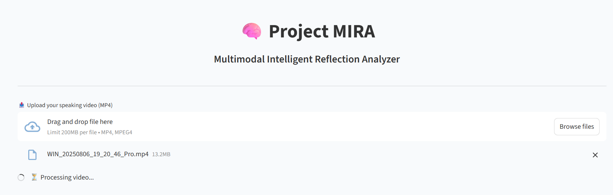
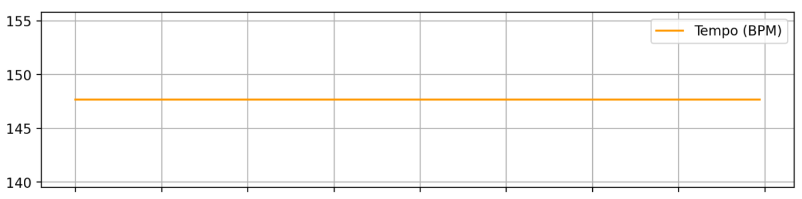
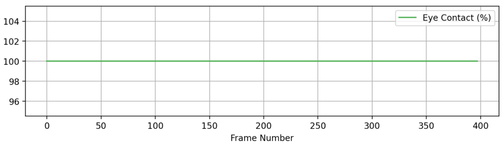
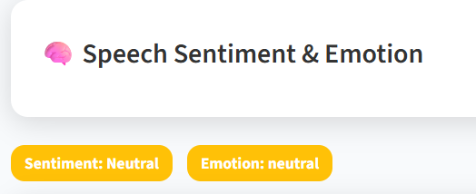
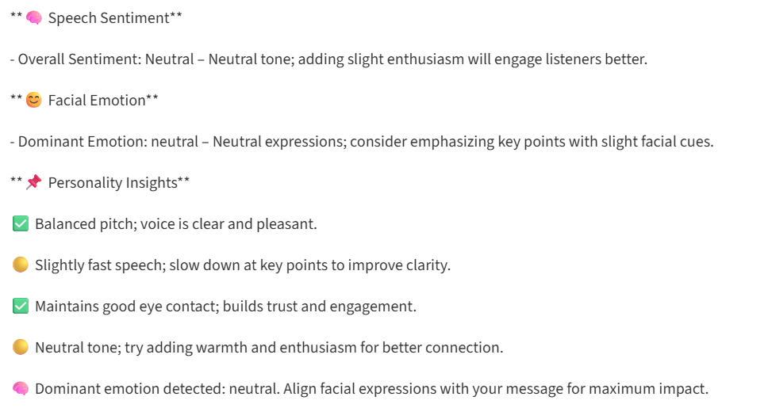
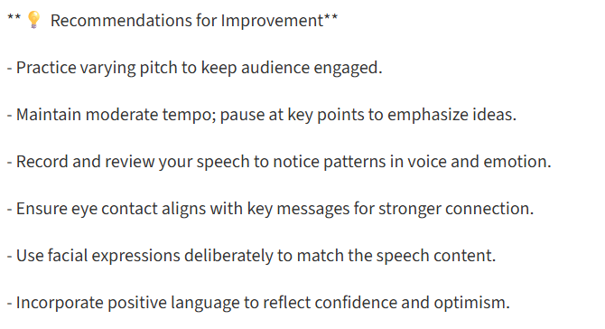
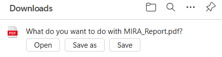
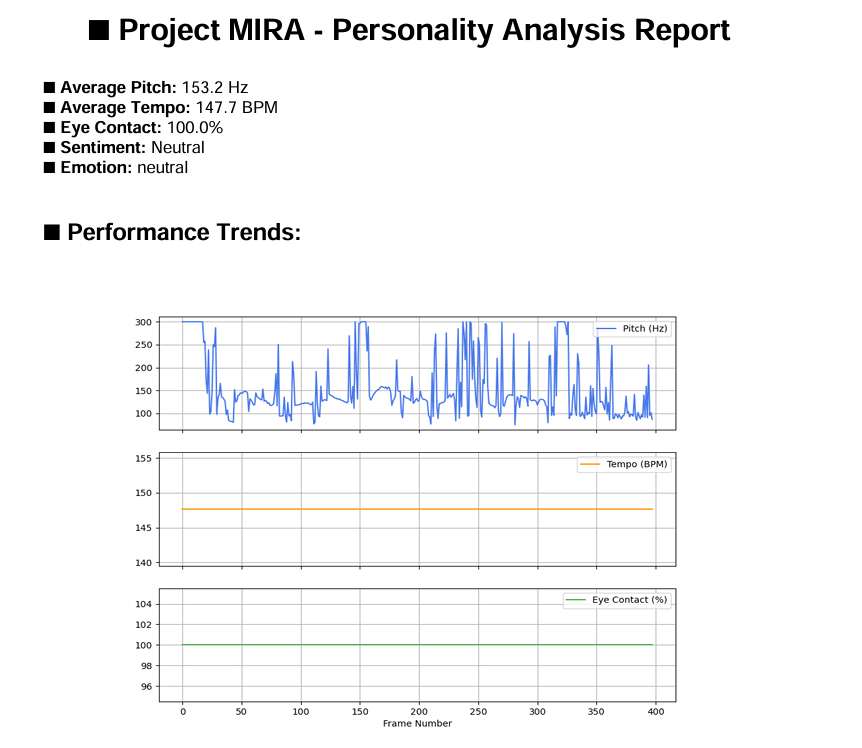

# MIRA 2.0 — Multimodal Intelligent Reflection Analyzer (Sentiment Analysis Project)

MIRA (Multimodal Intelligent Reflection Analyzer) is a multimodal AI-based system designed to analyze human emotions and sentiment using multiple input modalities such as **text**, **speech**, **facial expressions**, and **voice characteristics**.  
This project aims to provide a smarter and more accurate emotional reflection system by combining insights from different sources, making sentiment/emotion analysis more reliable than single-modal systems.

---

---

## 📸 Project Screenshots














## 🚀 Key Features

✅ **Text Sentiment Analysis**
- Analyzes sentiment from user-provided text
- Detects polarity: Positive / Negative / Neutral

✅ **Speech-to-Text + Speech Sentiment**
- Converts speech/audio input into text
- Performs sentiment analysis on recognized speech

✅ **Face Emotion Detection**
- Detects emotions from facial expressions
- Real-time face emotion analysis using Deep Learning models

✅ **Voice Emotion / Voice Feature Analysis**
- Extracts voice/audio features (pitch, energy, etc.)
- Helps infer emotional tone from voice

✅ **Multimodal Fusion**
- Combines results from multiple modalities
- Produces an overall final emotional/sentiment reflection

---

## 🧠 Tech Stack / Libraries Used

### Programming Language
- **Python**

### Libraries & Frameworks
- **Text Sentiment Analysis:** `TextBlob`
- **Speech Recognition:** `SpeechRecognition`
- **Face Emotion Detection:** `DeepFace`
- **Voice Analysis / Feature Extraction:** `Librosa`
- **Video / Face Landmark Analysis:** `MediaPipe`

Other common utilities:
- `numpy`, `opencv-python`, `matplotlib`, etc. (as required)

---

## 📁 Project Modules

- **Text Module:** Text sentiment prediction
- **Speech Module:** Speech input → text → sentiment
- **Video Module:** Face detection + emotion recognition
- **Audio Module:** Voice feature extraction + voice emotion inference
- **Fusion Module:** Final reflection based on multimodal outputs

---

## 🛠️ Installation / Setup

### 1) Clone the Repository
```bash
git clone https://github.com/mikeaviatron/MIRA---MULTIMODAL-INTELLIGENT-REFLECTION-ANALYZER-SENTIMENT-ANALYSIS-PROJECT-.git
cd Project_MIRA
````

### 2) Create Virtual Environment

```bash
python -m venv .venv
```

### 3) Activate Virtual Environment

**Windows (PowerShell):**

```bash
.\.venv\Scripts\activate
```

**Windows (CMD):**

```bash
.venv\Scripts\activate.bat
```

### 4) Install Dependencies

```bash
pip install -r requirements.txt
```

> If `requirements.txt` is not available, install required packages manually:

```bash
pip install textblob speechrecognition deepface librosa mediapipe opencv-python numpy
```

---

## ▶️ How to Run

Run the main application file (example):

```bash
python main.py
```

> If the project has separate modules, run the specific module scripts accordingly.

---

## 🎯 Applications

* AI Emotion Reflection System
* Human–Computer Interaction (HCI)
* Mental health & mood tracking assistance
* Interview sentiment/emotion analysis
* Student behavioral & engagement monitoring
* Customer feedback analysis

---

## 📌 Limitations

* Emotion detection can be affected by lighting and camera quality
* Speech recognition accuracy depends on mic quality and noise
* Results may vary across individuals due to different speaking styles and expressions

---

## 📌 Future Improvements

* Advanced multimodal fusion using transformers
* Emotion timeline tracking
* Better UI/UX (web or mobile)
* Larger dataset training and improved accuracy
* Cloud deployment for real-time usage

---

## 👨‍💻 Authors / Contributors

* **Mukund Nikhil**
  Final Year Project — Multimodal AI Emotion & Sentiment Analyzer

---

## 📜 License

This project is created for academic and educational purposes.

---

